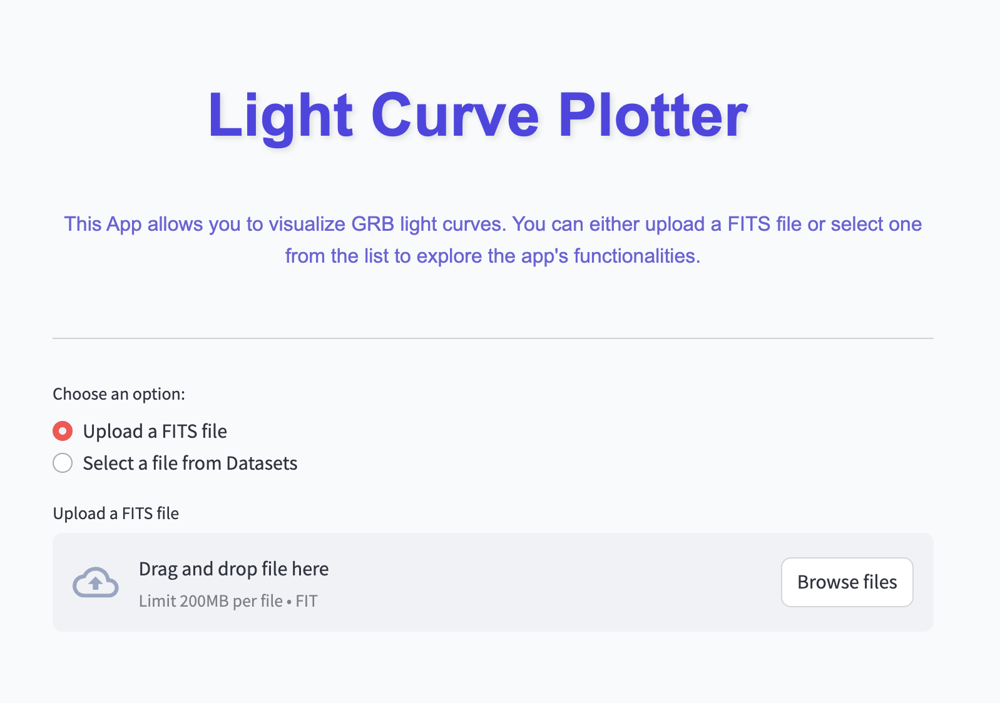

# Light Curve Plotter

This Streamlit app allows you to visualize Gamma-Ray Burst (GRB) light curves. You can either upload a FITS file or select one from the provided list to explore the app's functionalities.

Make sure you upload the *`tte`* file. You can download this from: [HEASARC](https://heasarc.gsfc.nasa.gov/w3browse/fermi/fermigbrst.html)

---

**Dashboard UI**

Checkout the App at: https://grb-light-curve-plotter.streamlit.app/

---

## Features

- Upload a FIT file or select one from the `Datasets` folder.
- Visualize the light curve with customizable bin width and color.
- Download the generated light curve plot as a JPEG image.

## Installation

1. Clone the repository
2. Install the dependencies from `requirement.txt`
3. Run Streamlit - In your Terminal: `streamlit run app.py`  
4. Few example files are present in Datasets/
5. Open your web browser and go to http://localhost:your-host-address
6. Choose an option to either upload a FIT file or select one from the Datasets folder.
7. Customize the bin width and color, and visualize the light curve.
8. Download the generated light curve plot as a JPEG image. 

## Acknowledgements
This project uses the following libraries and frameworks:
- Streamlit - For building and deploying the interactive app.
- Astropy - For handling FITS file data
- Seaborn & Matplotlib - For visualizing data plots.